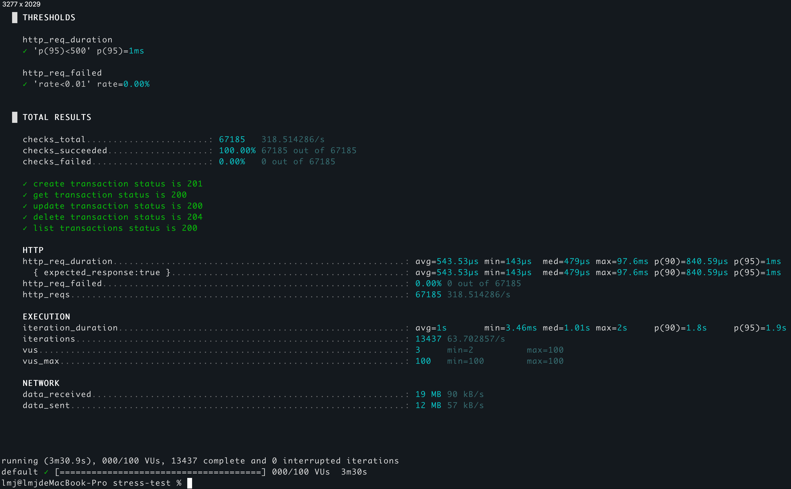

# 🏦 Home Task 银行交易模拟系统

http://81.68.193.75:8080/demo.html
http://localhost:8080/swagger-ui/index.html


## 🌟 项目背景
这是一个作业项目，模拟银行系统中的交易(Transaction)基本操作，附带一个简单的展示页面。
项目基于JDK 21 和 SpringBoot完成。

## 🚀 在线演示
* http://81.68.193.75:8080/demo.html  （作业检阅完成后将失效）
* http://81.68.193.75:8080/swagger-ui/index.html

## 💻 快速开始
### 环境要求
- JDK 21
- Maven 3.6+

### 本地运行步骤
```bash
git clone https://github.com/your-repo/bank-transaction-system.git
cd bank-transaction-system
mvn spring-boot:run
```

### 使用docker运行或者部署到k8s
    * 脚本在script/deploy 目录中
    * 详细步骤见文末

### 本地运行后可用的链接
    * 项目演示：http://localhost:8080/demo.html
    * API文档：http://localhost:8080/swagger-ui/index.html
    * 单元测试：mvn test
    * code style检查：mvn checkstyle:check
    * 压力测试：k6 run ./script/stress-test/stress-test.js  (需要先安装k6)


### 📡 API文档
    * 简要情况如下，详细请查阅swagger文档
        - http://localhost:8080/swagger-ui/index.html
        - http://81.68.193.75:8080/swagger-ui/index.html

#### 基础接口

| HTTP方法 | 端点路径                                        | 说明               | 成功状态码 | 内容类型        |
|----------|---------------------------------------------|-------------------|------------|-----------------|
| `POST`   | `/api/transactions`                         | 创建新交易记录     | 201        | application/json|
| `GET`    | `/api/transactions/{id}`                    | 获取单笔交易详情   | 200        | application/json|
| `GET`    | `/api/transactions?page={page}&size={size}` | 分页查询交易列表   | 200        | application/json|
| `PUT`    | `/api/transactions/{id}`                    | 更新交易记录       | 200        | application/json|
| `DELETE` | `/api/transactions/{id}`                    | 删除交易记录       | 204        | -               |

### 📂 项目目录结构
````
src/
├── main/
│   ├── java/
│   │   └── com/bank/transaction/
│   │       ├── config/       # 配置类
│   │       ├── controller/   # API接口
│   │       ├── dto/          # 数据传输对象
│   │       ├── exception/    # 异常处理
│   │       ├── model/        # 数据模型
│   │       ├── service/      # 业务逻辑
│   │       └── storage/      # 数据存储
│   │       └── validation/   # 业务校验器
│   └── resources/            # 静态资源
├── test/                     # 单元测试
script/                       # 部署、压测相关脚本
.github/                      # github workflow 相关配置
pom.xml                       # 项目配置

````
* validtion模块创建了了一个校验规则基类，方便扩展各种校验规则。当前只通过硬编码的方式实现了两个简易规则：账户黑名单判断、交易时间合法性判断。

### 🔧 开发规范

#### 分支管理策略
    * main - 生产环境稳定分支，只接受经过测试的代码
    * dev - 主要开发分支，用于日常集成
#### CI/CD
    * 代码推送到dev分支后会执行代码风格检查、单元测试
    * 创建从dev到main的PR后，会触发压测执行
    * 代码合入main分支后，部署流程会执行

### 其他
#### 压力测试执行步骤
1. `sudo apt-get update && sudo apt-get install k6`
2. 启动项目
3. `k6 run --out json=load-test-results.json ./script/stress-test/stress-test.js`

#### 使用docker运行
`docker build -t bank-transaction-service:1.0.0 -f ./script/deploy/local-build/docker/dockerfile .`
`docker run -d -p 8080:8080 --name transaction-system bank-transaction-system:1.0.0`

#### 使用k8s部署
依赖上一步build的最新版本docker镜像
`kubectl apply -f script/deploy/k8s/deployment.yaml`
`kubectl apply -f script/deploy/k8s/service.yaml`
